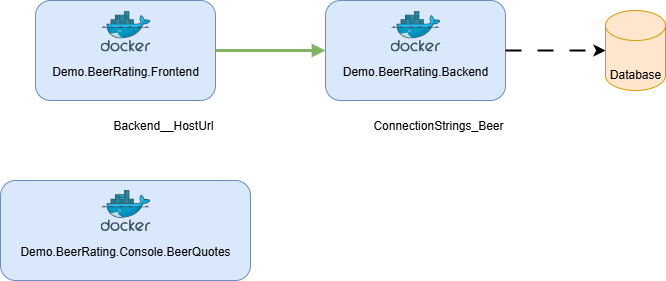

# Demos

## Vor Demo

- Infrastruktur bereitstellen: [Deployment](README.md#deployment)
- Laptop Prep
    - [ ] Alle unnötigen Programme aus Taskleiste schließen
    - [ ] Teams beenden
    - [ ] Energy saver aus

## App Demo erklären



## App Service

- Shared zeigen
    - Container Registry mit Images
- Erstellen einer neuen App (https://portal.azure.com/#create/Microsoft.WebSite)
    - Auswählen Publish Container
    - Datenbank: Keine
    - Container
        - Sidecar Support enablen
        - Azure Container Registry auswählen
    - Networking: Public Access
    - Monitoring: an
- Bereistellung zeigen
    - [rg-azh-demo1-webapps-mnvygrhd](https://portal.azure.com/#@dlindemann.de/resource/subscriptions/63d3cb88-9621-46c0-b611-36e23c5b402d/resourceGroups/rg-azh-demo1-webapps-mnvygrhd/overview)
    - Auf Frontend zugreifen und request machen
    - Backend Webapp Deployment
        - Deployment Center
        - Logs zeigen
    - Backend Webapp Environment Variablen zeigen
    - ggf. App Insights Backend zeigen

## Container Instance

- Erstellung einer Container Instance (https://portal.azure.com/#create/Microsoft.ContainerInstances)
    - Image auswählen
    - Size auswählen
    - Networking
        - DNS Label
        - DNS Label Scope Resource Group
    - Restart Policy: On Failure
- Bereitstellung zeigen
    - Zugriff auf Frontend: http://ci-azh-demo2-ci-frontend-mnvygrhd.cyhva3e9dganfwd6.polandcentral.azurecontainer.io:5179
        - Übersicht zeigen
        - Properties zeigen
        - Logs zeigen
    - Backend Container zeigen
        - Übersicht zeigen
        - Container zeigen inkl. Sidecar
        - Properties zeigen
        - Logs zeigen

## Azure Container Apps

- Erstellung einer Container App (https://portal.azure.com/#create/Microsoft.ContainerApp)
    - Deployment Source: Container Image
    - Container App Environment wählen
    - Container konfigurieren
    - Ingress konfigurieren
- Bereitstellung zeigen
    - Zugriff auf Frontend: https://ca-azh-demo3-aca-fend-mnvygrhd.nicesmoke-9955fb10.polandcentral.azurecontainerapps.io
        - Übersicht zeigen
        - Reviews zeigen
        - Containers zeigen
        - Scaling zeigen
    - Backend Container zeigen
        - Übersicht zeigen
        - Reviews zeigen
        - Containers zeigen
        - Scaling zeigen
        - Secrets zeigen
        - Log Stream zeigen

## AKS

- Erstellung AKS (https://portal.azure.com/#create/microsoft.aks)
    - AKS Version
    - Upgrades aus
    - Auth: Entra ID Auth mit K8s RBAC
    - Node Pools zeigen
    - Networking
        - Private Cluster aus
        - Azure CNI Overlay
        - DNS Name anpassen
        - Network Policy: Azure
    - Container Registry auswählen
    - Monitoring
        - Kein Prometheus
        - Kein Grafana
        - Alerts aus
    - Security
        - Workload Identity an
        - Azure Key Vault an
- AKS Cluster zeigen
    - Overview zeigen
    - Connect to AKS
- Zeige `MG` Resource Group
- Verwaltung über kubectl
    - Get resources

        ```bash
        kubectl get pods,deployment,svc,ingress
        ```

    - K8s Manifests zeigen
- Zugriff auf App über Ingress IP bzw. nip.io URL

## VNET Integration

- Ressourcen in *rg-azh-demo5-webapps-vnet* zeigen
- Netzwerk-Konfiguration von Frontend und Backend zeigen
- In Backend Private Endpoint Auflösung anzeigen

## Microsoft Defender for Cloud

- Show Recommendations oder Inventory
- Show Defender Plans (Environment Settings --> Subscription auswählen)
