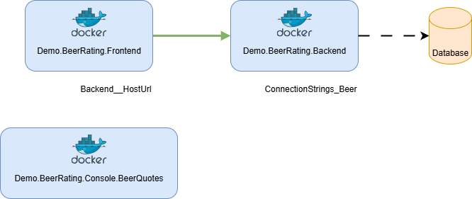

# azure-container-hosting

This project shows how a containerized app can be hosted and run on Azure.  
Azure services included:

- Azure App Services
- Azure Container Instances
- Azure Container Apps
- Azure Kubernetes Services
- Azure App Services with VNET integration

## Deployment

> ℹ️ **Info**  
> The setup steps require [Azure CLI](https://learn.microsoft.com/en-us/cli/azure/).  
> Install Azure CLI as described on https://learn.microsoft.com/en-us/cli/azure/install-azure-cli and run `az login` to authenticate.

> ℹ️ **Info**  
> All Azure resource creating commands use the region *Poland Central*. Change it, if required.

### 1. Prerequisite: Create AKS Administrator Group

Create group AKS Admins:

```bash
az ad group create \
    --display-name 'AKS Admins' \
    --mail-nickname aksadmins \
    --description 'Administrators of AKS Clusters are placed in this group' \
    --query '{objectId: id, displayName: displayName, mailNickname: mailNickname, description: description}' \
    -o table
```

Add current user to owners and mebers list

```bash
az ad group owner add \
    --group 'AKS Admins' \
    --owner-object-id $(az ad signed-in-user show --query id --output tsv)
az ad group member add \
    --group 'AKS Admins' \
    --member-id $(az ad signed-in-user show --query id --output tsv)
```

### 2. Deploy sharable Azure resources

Deploy sharable resources:

- Azure Container Registry
- Key Vault
- SQL Server
- Private DNS Zone (privatelink.azurewebsites.net)

```bash
az deployment sub create \
    --name="azure-container-hosting-$(date +%Y%m%d%H%M%S)" \
    --location polandcentral \
    --template-file bicep/main.bicep \
    --parameters aksEntraAdminGroupObjectIds='' skipDemo1WebApps=true skipDemo2ContainerInstances=true skipDemo3ContainerApps=true skipDemo4Aks=true skipDemo5Vnet=true
```

### 3. Build container images and push them to ACR

> ℹ️ **Info**  
> It's required to have [Docker](https://www.docker.com) or an equivalent container runtime installed on the system.

```bash
scripts/01-build-images.sh && scripts/02-push-to-acr.sh
```

### 4. Apply SQL migrations and seed data

```bash
scripts/03-apply-sql-migrations.sh
```

### 5. Deploy demo resources

Deploy resources:

- App Services + dependencies
- Container Instances + dependencies
- Azure Container Apps + dependencies
- Azure Kubernetes service + dependencies

> ⚠️ **Warning**  
> The code uses the previously created *AKS Admins* group. If you created the group with another name, replace the name group of in the parameter assignment of `aksEntraAdminGroupObjectIds` in the following command.

```bash
az deployment sub create \
    --name="azure-container-hosting-$(date +%Y%m%d%H%M%S)" \
    --location polandcentral \
    --template-file bicep/main.bicep \
    --parameters aksEntraAdminGroupObjectIds=$(az ad group show -g 'AKS Admins' --query id -o tsv)
```

### 6. Apply AKS configurations and manifests

Script configures AKS cluster:

- Add nginx ingress controller
- Configure ingress routes
- Add secret provider class to access key vault
- Deploy app

```bash
scripts/04-configure-aks.sh
```

## Clean-up

Run the cleanup script

```bash
scripts/06-cleanup.sh
```

## Technology Stack

The project hosts an application on multiple Azure container environments.
The application is a small beer rating application with a client-server architecture and a small dummy console application.

Applications:

- [Demo.BeerRating.Backend](src/Demo.BeerRating.Backend)
    - ASP.NET Web API
    - Entity Framework with SQL Server
- [Demo.BeerRating.Frontend](src/Demo.BeerRating.Frontend)
    - ASP.NET Razor Server Pages
- [Demo.BeerRating.Console.BeerQuotes](src/Demo.BeerRating.Console.BeerQuotes)
    - .NET Console

Framework and Tools:

- .NET 9
    - ASP.NET
    - Entity Framework
- Microsoft SQL Server
- Bicep

Connections:



## Run locally with compose file

1. Ensure [`docker compose`](https://docs.docker.com/compose/install/) or equivalent is available
2. Build container images

    ```bash
    scripts/01-build-images.sh
    ```

3. Run `docker compose up` from project root folder
4. Access applications via frontend: http://localhost:5179
